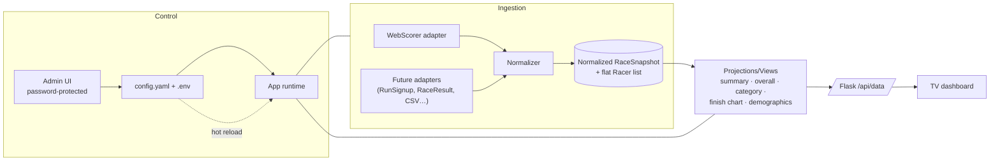
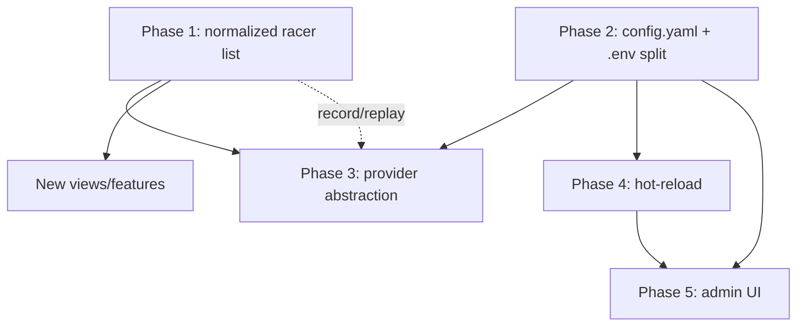

# Race Dashboard: Platform & Refactor Roadmap

> Status: **Proposed** · Owner: maintainers · Last updated: 2026-08-29
>
> This is a strategic roadmap, not an implementation plan. Each phase below is
> delivered through the normal workflow: `brainstorming` → a design spec in
> `docs/superpowers/specs/` → an implementation plan in
> `docs/superpowers/plans/` → subagent/executing-plans implementation. Phases
> are sized so each one ships working, testable software on its own and can be
> reordered as priorities change.

## Why now

The dashboard was run live at a gravel race and drew a constant crowd. That
success exposed the next set of constraints:

1. **The data model fights us.** The app consumes WebScorer's response mostly
   as-is, sometimes reading `Overall` groupings and sometimes `Category`
   groupings, and re-derives the same facts in several places
   (`process_race_data`, `build_finish_chart_data`, `build_demographics_data`
   each re-walk `Results` and re-classify racers). Presenting the data a new
   way means fighting the source structure instead of querying a clean list.
2. **We're single-platform.** All ingestion logic is WebScorer-shaped. Any
   other timing platform would require duplicating the whole pipeline.
3. **Race-day config is static.** Changes require editing `.env` and
   restarting the process while a crowd watches the TV.

This roadmap addresses all three, in an order where each phase de-risks the
next. **Phase 1 (normalization) is the keystone.** It's the change that makes
everything after it easier and removes the day-to-day frustration of
manipulating the data.

## North Star

> A small, dependable race-day appliance that ingests results from **any**
> supported timing platform into **one normalized, filterable list of
> racers**, renders configurable views from that single source of truth, and
> is controllable at race time from a **password-protected admin UI** that
> applies changes live, with no restarts and no editing files on a Pi.

## Guiding principles

- **One source of truth.** Every view is a query/projection over a single
  normalized racer list. No view reaches back into raw platform payloads.
- **Provider-agnostic core.** Ingestion adapters translate a platform payload
  into the normalized model; nothing downstream knows which platform it came
  from.
- **Secrets in `.env`, everything else in `config.yaml`.** API keys stay out of
  git; all non-secret config becomes committable and hot-reloadable. This also
  retires the ongoing `.env` ↔ `.env.example` sync burden.
- **Live by default.** Config and data both refresh without a restart.
- **Ship thin vertical slices.** Prefer a working end-to-end slice over a
  perfect subsystem. Every phase leaves the app usable.
- **Test-first.** New pure functions (normalization, projections, config
  loading/merging) are covered by pytest before wiring into Flask.

---

## Target architecture



### The normalized model (keystone deliverable of Phase 1)

A platform adapter produces a `RaceSnapshot`. The core of it is a **single flat
list of `Racer` records**, with no groupings and no overall-vs-category
duplication. Groupings become *attributes you filter on*, not *containers you
iterate*.

```python
# Illustrative shape, finalized in the Phase 1 spec.
RaceSnapshot = {
    "race": {
        "name": str,
        "date": str,
        "sport": str,
        "start_time": str | None,     # normalized ISO-ish or seconds-since-midnight
        "source": str,                 # "webscorer" | ...
    },
    "racers": [ Racer, ... ],          # THE single source of truth
}

Racer = {
    "bib": str,
    "name": str,
    "distance": str | None,            # e.g. "Long Course (88 miles)"
    "category": str | None,            # e.g. "Men 40-49"
    "gender": str | None,
    "age": int | None,
    "team": str | None,
    "status": "FINISHED" | "IN_PROGRESS" | "DNS" | "DNF" | "DSQ",
    # --- facts needed to rank, parsed ONCE at normalization time ---
    "elapsed_seconds": float | None,     # the racer's duration (their "Time"), the sort key
    "start_tod_seconds": float | None,   # time-of-day started, seconds since midnight (wave/individual starts)
    "time_display": str | None,          # raw formatted string retained for display (e.g. "1:23:45")
    # --- platform's official place, kept ONLY to reconcile/validate, not to display ---
    "source_place": int | None,          # WebScorer's Place for this racer's native grouping
}
```

**Place is derived, not stored.** In a flat list the same racer is
simultaneously "3rd overall" and "1st in M40-49"; place is a function of *which
grouping is on screen* × sort order, so each view computes it by filtering to
the grouping, sorting by `(finished-first, elapsed_seconds asc)`, and assigning
`1..N`. This is what lets us rank *any* grouping (including custom ones the
platform never computed) and removes today's `_add_category_places` cross-copy
hack. `source_place` is retained only as a reconciliation safety net. The Phase
1 characterization tests assert derived places match the platform's official
numbers on real dumps, catching any tie/DSQ ordering differences.

**Finish-time is derived too.** `finish_tod_seconds = start_tod_seconds +
elapsed_seconds` is computed inside the finish-histogram projection rather than
stored, so the model carries only the two parsed primitives and nothing that can
drift out of sync.

**`status` stays: it's the standardization boundary, not redundant data.**
DNS/DNF/DSQ all share "no elapsed time," so status can't be reduced to a
finish-time null-check, and the platform encodes it inline (WebScorer packs it
into the `Time` string). The normalizer classifies **once** into a canonical
enum so page generators filter on `status` instead of re-implementing that
business logic, and so a new platform's different representation (boolean flag,
separate column, other sentinels) is translated in the adapter rather than
leaking downstream. The normalizer guarantees the invariant
`status == "FINISHED"` ⟺ `elapsed_seconds is not None`; `elapsed_seconds` answers
"how fast," `status` answers "did they finish / why not."

Downstream, current logic collapses into small pure projections over
`racers`, for example:

```python
overall_by_distance(racers)     # replaces the Overall-grouping walk
category_leaderboards(racers)   # replaces the Category-grouping walk
finish_histogram(racers, ...)   # no more re-parsing StartTime/Time
demographics(racers)            # filter status? No, count all registrants
```

Time parsing, status classification, and place resolution happen **once** at
normalization time, not repeatedly per view. This is the concrete cure for
"fighting the structure to display it how I want."

---

## Phased roadmap

Each phase is independently shippable and gets its own spec + plan.

> **Ordering note:** Phases 1 (normalize) and 2 (config split) are technically
> independent: they touch different files and could run in parallel. They're
> ordered by *value*, not dependency: normalization is the keystone and the
> biggest day-to-day pain relief, so it goes first. Config split has no
> dependents until the control plane (hot-reload, admin), so it lands right
> before the work that needs it.

### Phase 1: Normalize to a single filterable racer list (keystone)
**Goal:** Introduce `RaceSnapshot` + flat `Racer` list and route **all** views
through it. No behavior change visible on the TV; big change underneath.

- New `normalize.py` (or `providers/webscorer.py`) with
  `normalize_webscorer(api_response) -> RaceSnapshot`.
- Parse time/status/places **once** during normalization.
- Rewrite `process_race_data`, `build_finish_chart_data`,
  `build_demographics_data` as pure projections over `snapshot["racers"]`.
- Characterization tests first: capture current `/api/data` output for the
  sample dumps (`api_dump_*.json`), then refactor until output is byte-for-byte
  (or field-for-field) equivalent.

**Exit criteria:** All existing tests pass; new projection tests added; the
three view builders no longer walk raw `Results`; a documented `Racer`/
`RaceSnapshot` schema exists.

**Why this unlocks everything:** New views become filter/sort/group-by
expressions over one list. Multi-platform becomes "write one adapter."

**Risks:** Subtle place/tie/dedup differences between overall and category
sources. Mitigate with golden-file characterization tests against real dumps
before touching logic.

---

### Phase 2: Config split (secrets vs. `config.yaml`)
**Goal:** Move all non-secret config into a committable `config.yaml`; keep only
secrets in `.env`. Small, low-risk, and unblocks the control plane (hot-reload,
admin) that follows.

- Introduce `config.yaml` (committed) for every current non-secret option
  (intervals, toggles, layout, colors, chart buckets, etc.).
- Keep `WEBSCORER_API_ID` / `WEBSCORER_API_TOKEN` (and future provider secrets)
  in `.env` only.
- `load_config()` merges: `config.yaml` (base) ← `.env` (secrets) ←
  environment overrides. Precedence documented and tested.
- Retire the `.env`/`.env.example` parity rule for non-secret keys; `.env.example`
  shrinks to secrets only.
- Startup config printout continues to show the **full** universe of options
  (existing project rule).

**Exit criteria:** App runs identically from `config.yaml` + secret-only `.env`;
tests cover merge precedence and defaults; docs/README updated; existing
`.env`-only setups still work (back-compat shim or documented migration).

**Risks:** Precedence confusion; migration for existing users. Mitigate with a
one-time migration note and a fallback that reads legacy `.env` keys.

---

### Phase 3: Provider abstraction (make it pluggable)
**Goal:** Define the ingestion boundary so a new platform is one adapter, not a
new pipeline. Ship with WebScorer as the reference adapter.

- `providers/` package with a documented contract:
  `fetch(config, secrets) -> raw` and `normalize(raw) -> RaceSnapshot`.
- Config selects the active provider (`source: webscorer` in `config.yaml`).
- Extract a tiny provider registry; WebScorer becomes the first registered
  provider with zero behavior change.
- Add a **CSV/spreadsheet adapter** as the cheapest possible proof the
  abstraction holds (also useful for offline demos and testing without an API).

**Exit criteria:** Switching `source` swaps ingestion with no view changes;
adapter contract documented; CSV adapter covered by tests.

**Risks:** Over-abstracting for platforms we don't have yet. Mitigate by
validating the contract against exactly two very different sources (WebScorer
JSON + CSV) and no more.

---

### Phase 4: Live config hot-reload
**Goal:** Config changes take effect mid-run without a restart.

- Watch `config.yaml` (mtime/poll) and re-merge on change.
- Thread-safe swap of the active config used by the poll loop and `/api/data`
  (reuse the existing `_cache_lock` pattern).
- Distinguish reloadable keys (intervals, toggles, layout) from those needing a
  restart (e.g. changing `source`); surface which is which.
- Push a lightweight "config version" in `/api/data` so the frontend can react
  (e.g. re-read rotation timing) without a full reload.

**Exit criteria:** Editing `config.yaml` while running updates behavior within
one refresh cycle; documented list of hot vs. restart-required keys; tested.

**Risks:** Race conditions on swap; partial/invalid YAML mid-edit. Mitigate with
atomic re-read + validation, and keep last-good config on parse failure.

---

### Phase 5: Password-protected admin UI
**Goal:** A GUI to edit `config.yaml` live, secured by a single shared password
(env-configured), intended for a trusted LAN.

- `/admin` route behind session auth; password from `.env`
  (`ADMIN_PASSWORD`), compared with a constant-time check; no password → admin
  disabled.
- Form/controls for the reloadable config surface; writes `config.yaml`
  atomically, which Phase 4 picks up live.
- Validation + inline errors; never expose secrets in the UI or API.
- CSRF protection on writes; security headers; document the LAN-only threat
  model in the README (no TLS/user accounts by design).

**Exit criteria:** Operator can change intervals/toggles/layout from a phone on
the race-day network and see the TV update within a cycle; auth + CSRF tested;
security notes documented.

**Risks:** Auth footguns and injection. Mitigate with a minimal, well-reviewed
auth path, output-encoded templates, and a `receiving-code-review` pass before
merge.

---

## Additional features worth considering

Ranked by likely payoff for race-day success. Each is optional and would follow
the same spec → plan flow.

**High value**
- **Snapshot record & replay.** Persist each poll's `RaceSnapshot` to disk;
  replay for demos, testing, and post-race review without hitting an API. Cheap
  once Phase 1 exists and helpful for development.
- **Manual refresh + connection health banner in admin.** A "refresh now"
  button and a clear API-status indicator (last success, error) so operators
  aren't guessing when data looks stale.
- **Bib/name search & spotlight.** With a flat racer list, a quick lookup that
  spotlights a racer on the TV ("find #142") is easy and crowd-pleasing.

**Medium value**
- **Recent finishers ticker.** A rolling "just finished" strip using
  `finish_seconds`, ambient content between page rotations.
- **Per-view filter/sort config from admin.** Expose the normalized model's
  filter/group-by so operators compose custom category pages live.
- **Multi-race / multi-day support.** Select among posted races from admin;
  useful for events with several starts.
- **Kiosk auto-recovery.** Watchdog that restarts Chromium/app on crash for
  unattended all-day operation.

**Lower value / later**
- **Sponsor/slide rotation.** Interleave sponsor slides between result pages.
- **Estimated-finish projections.** Use start + pace to predict finishers.
- **Export/printable results.** Post-race PDF/CSV from the normalized snapshot.
- **Metrics/telemetry.** Lightweight local counters (poll latency, error rate)
  visible in admin.

---

## Sequencing & dependencies



- **Phase 1 (normalize) goes first**: it's the keystone. Everything downstream
  is easier after it, and it's the biggest pain relief.
- **Phase 2 (config split) is independent of Phase 1** (different files) but is
  ordered second because its only dependents are the control plane below it; it
  could run in parallel with Phase 1 if two people are working.
- Phase 3 depends on Phase 1's model (and uses Phase 2's `config.yaml` for the
  `source:` selector).
- Phase 4 depends on Phase 2 (a `config.yaml` to watch).
- Phase 5 depends on Phase 4 (so admin edits apply live) and Phase 2 (a
  `config.yaml` to edit).

## Decisions captured

- **Config:** secrets in `.env`; all other config in committable `config.yaml`.
  Eliminates `.env`/`.env.example` sync for non-secrets.
- **Admin auth:** single shared password from env; LAN-only threat model;
  no user accounts or TLS in scope.
- **Platforms:** the immediate goal is the *normalization payoff*, not shipping
  many providers. Abstraction is validated with WebScorer + a CSV adapter;
  real third-party providers are deferred until there's demand.

## Open questions

- Migration path for existing `.env`-only deployments when `config.yaml` lands
  (auto-generate on first run vs. documented manual step?).
- Exact `config.yaml` schema and which keys are hot-reloadable vs.
  restart-required.
- Whether normalization should retain any raw display strings beyond `Time`
  (e.g. formatted pace) or recompute all formatting in projections.
- Admin write model: edit full `config.yaml` vs. a curated subset of safe keys.

---

_When a phase is ready to build, start with `brainstorming` to produce its
design spec, then `writing-plans` for the task-by-task plan._
